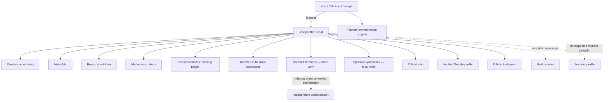

# Entity and evidence graph

Strong edges: the site visibly connects founder, one-person studio, Toronto/GTA, services, price and evidence; Organization/Person schema uses stable relationships; official Instagram and Google profile connect to the brand; client/local work is separated from founder-owned projects.

Weak edges, ordered: client-controlled Dream confirmation; real client review; Dream conversations-to-revenue funnel; independent founder profile linking Yusuf/Joseph; genuine OAI request logs; self-sourced paid client attributable to AI/search; exact public YouTube URL. Strengthen the first three before adding more owned pages.
